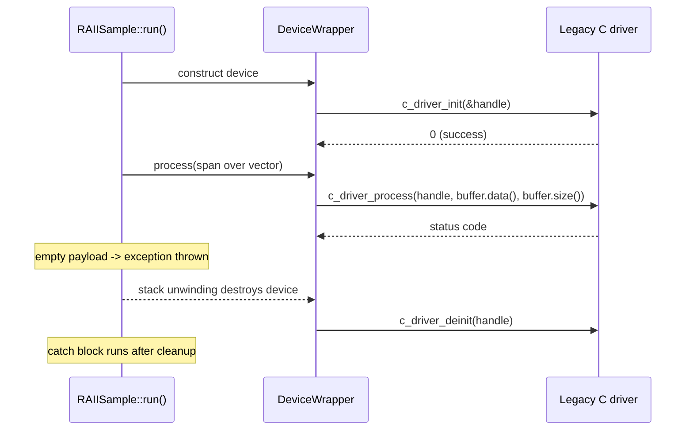

# RAII (Resource Acquisition Is Initialization)

## Overview

RAII is a C++ programming idiom that ties resource management to object lifetime. Resources are acquired during object construction and released during object destruction, ensuring that resources are properly cleaned up even in the presence of exceptions.

**The Problem:**
Resources (memory, files, sockets, mutexes) need to be released after use. Forgetting to release them causes leaks. Exception paths make manual cleanup even harder.

```cpp
// ❌ BAD: Manual resource management - easy to leak!
void processFile(const std::string& path) {
    FILE* file = fopen(path.c_str(), "r");
    if (!file) return;  // OK
    
    try {
        doSomething();     // What if this throws?
        doSomethingElse(); // Or this?
    } catch (...) {
        fclose(file);      // Must remember to close here!
        throw;
    }
    
    fclose(file);  // And here! Easy to forget.
}
```

**The Solution: RAII**
Tie the resource lifetime to an object's lifetime. Acquire in constructor, release in destructor. C++ guarantees destructors run when objects go out of scope - even during exceptions!

```cpp
// ✅ GOOD: RAII wrapper handles cleanup automatically
class FileHandle {
    FILE* file;
public:
    explicit FileHandle(const std::string& path) 
        : file(fopen(path.c_str(), "r")) 
    {
        if (!file) throw std::runtime_error("Cannot open file");
    }
    
    ~FileHandle() { 
        if (file) fclose(file);  // Always called, even during exceptions!
    }
    
    // Prevent copying (or implement deep copy)
    FileHandle(const FileHandle&) = delete;
    FileHandle& operator=(const FileHandle&) = delete;
    
    // Allow moving
    FileHandle(FileHandle&& other) noexcept : file(other.file) {
        other.file = nullptr;
    }
    
    FILE* get() { return file; }
};

void processFile(const std::string& path) {
    FileHandle file(path);  // Resource acquired
    doSomething();          // If this throws...
    doSomethingElse();      // Or this...
}   // file destructor ALWAYS runs - no leak possible!
```

**RAII in the Standard Library:**
| Resource | RAII Wrapper |
|----------|--------------|
| Heap memory | `std::unique_ptr`, `std::shared_ptr` |
| Arrays | `std::vector`, `std::array` |
| Strings | `std::string` |
| Files | `std::fstream`, `std::ifstream`, `std::ofstream` |
| Mutexes | `std::lock_guard`, `std::unique_lock`, `std::scoped_lock` |
| Threads | `std::jthread` (C++20) |

**Key Insight:** If you're writing `new`/`delete`, `malloc`/`free`, `fopen`/`fclose`, or any acquire/release pair manually, you probably need an RAII wrapper instead!

---

## Key Benefits

- **Automatic Resource Management**: No need to manually release resources
- **Exception Safety**: Resources are released even if an exception occurs
- **Cleaner Code**: Reduces boilerplate code for resource management
- **Prevents Resource Leaks**: Guarantees cleanup

## Real-World Examples

See `RAIISample.cpp` for the implementations.

### Example 1: File Handle Management

In this example, we create a `File` class that demonstrates RAII by automatically opening and closing a file. This ensures that the file is always closed, preventing resource leaks.

```cpp
{
    File myFile("example.txt", "w");
    // File is open here
    myFile.write("Hello, RAII!");
    // File is automatically closed when myFile goes out of scope
}
```

### Example 2: ScopedTimer (Execution Time Measurement)

This example demonstrates RAII for automatic timing - a practical pattern for profiling and debugging. The timer starts when constructed and automatically reports the elapsed time when it goes out of scope.

```cpp
// ✅ GOOD: RAII timer - no need to manually stop or calculate duration
class ScopedTimer {
    std::string operationName;
    std::chrono::time_point<std::chrono::high_resolution_clock> startTime;
public:
    explicit ScopedTimer(const std::string& name)
        : operationName(name), startTime(std::chrono::high_resolution_clock::now()) {}

    ~ScopedTimer() {
        auto endTime = std::chrono::high_resolution_clock::now();
        auto duration = std::chrono::duration_cast<std::chrono::milliseconds>(endTime - startTime);
        std::cout << operationName << " completed in " << duration.count() << " ms\n";
    }

    // Non-copyable, non-movable
    ScopedTimer(const ScopedTimer&) = delete;
    ScopedTimer& operator=(const ScopedTimer&) = delete;
};

// Usage
{
    ScopedTimer timer("Database query");
    performDatabaseQuery();  // If this throws, timer still reports!
}   // Automatically prints: "Database query completed in X ms"
```

**Key Insight:** Nested timers work naturally with RAII - inner timers report first (LIFO order), just like a call stack:

```cpp
{
    ScopedTimer outer("Outer");
    {
        ScopedTimer inner("Inner");
        // ... work ...
    }   // Inner reports first
}   // Outer reports second
```

### Example 3: Wrapping a Legacy C Driver (RAII + `std::span`)

**Purpose:** Keep your C++ layer memory-safe while it drives a C API that expects a raw `uint8_t*` buffer and a separate `int len`.

You cannot change the driver. You can change everything that touches it.

#### The C interface you are stuck with

```cpp
typedef void* DeviceHandle;

int c_driver_init(DeviceHandle* handle);
int c_driver_process(DeviceHandle handle, const uint8_t* buffer, int len);
int c_driver_deinit(DeviceHandle handle);
```

That shape carries two classic defects:

- **The handle leaks.** Every `init()` needs a matching `deinit()`. An early `return`, a `break`, or a thrown exception skips it.
- **The pointer and the length drift apart.** Nothing checks that `len` matches the buffer. Pass the wrong number and the driver reads past the end of your memory.

RAII fixes the first defect. `std::span` fixes the second.

> **Term:** `std::span` (C++20) is a non-owning view over a contiguous sequence. It stores a pointer and a size, nothing more. It never allocates, copies, or frees.

#### Who owns what

| Layer | Owns | Responsibility |
|---|---|---|
| `c_driver_*` functions | The device handle | Legacy C code. Left untouched. |
| `DeviceWrapper` | The handle's lifetime | Calls `init()` when constructed, `deinit()` when destroyed. |
| `std::span<const std::uint8_t>` | Nothing | Carries pointer and length together as one argument. |
| Caller's `std::vector` | The bytes | Owns the memory the span views. Outlives the span. |

#### Data flow



The last three steps are the point of the example. Cleanup happens **before** the `catch` block, because destructors run during stack unwinding.

#### Step 1: Tie the handle to a scope

The constructor acquires the handle and the destructor releases it. See [RAIISample.cpp:154-171](RAIISample.cpp#L154-L171):

```cpp
class DeviceWrapper {
private:
  DeviceHandle handle = nullptr;

public:
  // Constructor: Acquire resource (initialize the device)
  DeviceWrapper() {
    if (c_driver_init(&handle) != 0) {
      throw std::runtime_error("Failed to initialize C driver");
    }
  }

  // Destructor: Release resource (deinitialize the device)
  ~DeviceWrapper() {
    if (handle) {
      c_driver_deinit(handle);
    }
  }
```

Throwing from the constructor is deliberate. If `init()` fails, no object exists, so no destructor runs and no half-built device escapes.

#### Step 2: Decide the ownership rules

A handle has exactly one owner. Copying would call `deinit()` twice on the same pointer, so the copy operations are deleted. See [RAIISample.cpp:173-188](RAIISample.cpp#L173-L188):

```cpp
  // A handle must have exactly one owner - copying would deinit() it twice
  DeviceWrapper(const DeviceWrapper &) = delete;
  DeviceWrapper &operator=(const DeviceWrapper &) = delete;

  // Moving transfers ownership and leaves the source with a null handle
  DeviceWrapper(DeviceWrapper &&other) noexcept
      : handle(std::exchange(other.handle, nullptr)) {}
  DeviceWrapper &operator=(DeviceWrapper &&other) noexcept {
    if (this != &other) {
      if (handle) {
        c_driver_deinit(handle);
      }
      handle = std::exchange(other.handle, nullptr);
    }
    return *this;
  }
```

`std::exchange` does the transfer in one step: it takes the old handle and nulls the source. The moved-from wrapper then destroys safely, because its destructor sees `nullptr`.

#### Step 3: Replace `(pointer, length)` with a span

The span is unpacked into the C call at the last possible moment. See [RAIISample.cpp:193-199](RAIISample.cpp#L193-L199):

```cpp
  int process(std::span<const std::uint8_t> buffer) {
    if (!handle) {
      return -1;
    }
    return c_driver_process(handle, buffer.data(),
                            static_cast<int>(buffer.size()));
  }
```

Three details earn their place here:

- **`const` element type** tells the reader and the compiler that `process` only reads the bytes.
- **`static_cast<int>`** is explicit, because `size()` returns `std::size_t` and the C API wants `int`.
- **One parameter, not two** means a caller can no longer pass a length that disagrees with the buffer.

#### Using it

The caller passes containers, not pointers. See [RAIISample.cpp:253-284](RAIISample.cpp#L253-L284):

```cpp
try {
  // c_driver_init() runs here
  DeviceWrapper device;

  std::vector<std::uint8_t> packet{0x01, 0x02, 0x03, 0x04, 0x05};

  // The vector converts to a span implicitly - no length to pass by hand
  if (device.process(packet) != 0) {
    throw std::runtime_error("C driver processing failed");
  }

  // A subspan is just another view: no copy, no pointer arithmetic
  if (device.process(std::span{packet}.subspan(2)) != 0) {
    throw std::runtime_error("C driver processing failed");
  }

  // The driver rejects an empty payload, so this one throws...
  std::vector<std::uint8_t> emptyPacket;
  if (device.process(emptyPacket) != 0) {
    throw std::runtime_error("C driver processing failed on empty payload");
  }
} catch (const std::exception &e) {
  // ...and c_driver_deinit() has already run during stack unwinding
  std::cerr << "Error: " << e.what() << std::endl;
}
```

`std::span{packet}.subspan(2)` skips the first two bytes without copying anything. Slicing a raw buffer by hand means new pointer arithmetic and a new length, and both can be wrong.

#### What it prints

```text
=== Example 3: Legacy C Driver Wrapper (RAII + std::span) ===
[C driver] init() -> device #42
[C driver] process() -> device #42, 5 bytes, checksum = 15
[C driver] process() -> device #42, 3 bytes, checksum = 12
[C driver] deinit() -> device #42
Error: C driver processing failed on empty payload
Device released automatically - no manual deinit() call.
```

Read the last three lines in order. The device shuts down first, then the error surfaces. Nobody wrote a cleanup call to make that happen.

#### Pitfalls to watch

- **Dangling views:** A span is a pointer and a size. Never let it outlive the container it views, and never return one that points at a local.
- **Spans of temporaries:** `device.process(makeVector())` leaves the span dangling once the statement ends. Bind the vector to a named variable first.
- **Contiguous storage only:** `std::vector`, `std::array`, and C arrays convert to a span. `std::list` and `std::deque` do not.
- **Size conversions:** Cast `size()` to the C type explicitly, and check the payload against the API's limits before you narrow it.
- **Buffers the C driver allocates:** When the driver hands you memory, keep the handle in the RAII wrapper and expose the memory as a span over it.

---

This pattern is commonly used for:
- File handles
- Network sockets
- Database connections
- Mutex locks
- Memory management (smart pointers)
- Execution timing and profiling
- Scope guards and cleanup actions
- Wrapping legacy C APIs